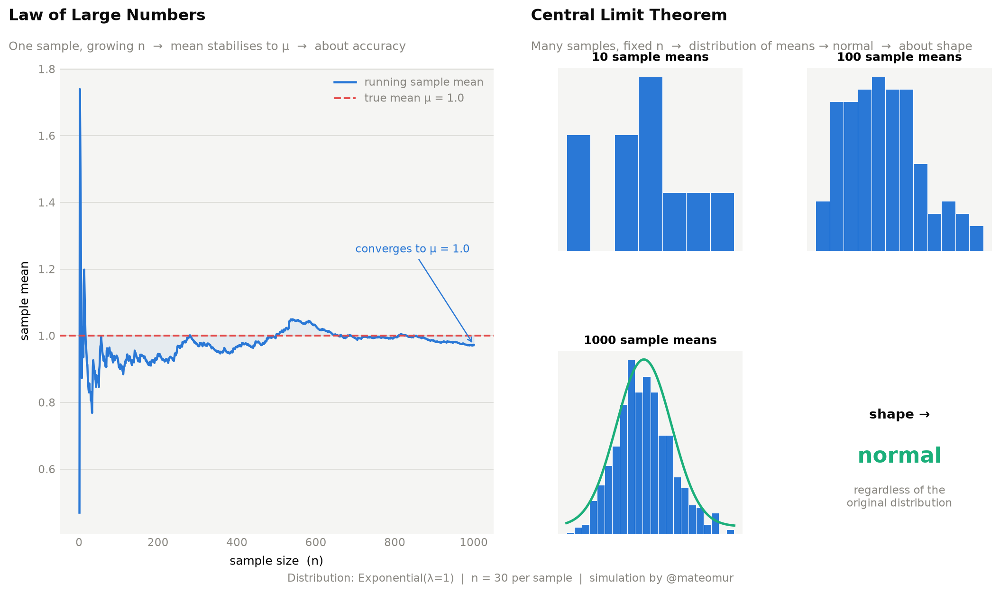

# LLN vs CLT — A Visual Simulation in Python

A from-scratch simulation that visualizes two of the most fundamental theorems in statistics, side by side.



## What this shows

These two theorems are often confused. They answer completely different questions.

**Law of Large Numbers (LLN)**
As sample size *n* grows, the sample mean converges to the true population mean μ. It's about *accuracy* — one sample getting more reliable over time.

**Central Limit Theorem (CLT)**
As the number of samples increases, the distribution of sample means becomes normal — regardless of the original distribution's shape. It's about *shape* — many samples revealing a pattern.

| | LLN | CLT |
|---|---|---|
| Question | Does my estimate converge? | What shape does the sampling distribution take? |
| Varies | Sample size n | Number of samples |
| About | Accuracy | Shape |
| Result | mean → μ | distribution → normal |

## Simulation details

- Distribution: Exponential(λ=1) — deliberately skewed to make the CLT effect dramatic
- Sample size per draw: n = 30
- CLT histograms: 10, 100, and 1000 sample means
- LLN: running mean tracked across n = 1 to 1000

## Setup

```bash
git clone https://github.com/mateomur/lln-vs-clt-simulation.git
cd lln-vs-clt-simulation
python -m venv venv
source venv/bin/activate
pip install -r requirements.txt
python lln_vs_clt.py
```

This generates `lln_vs_clt.png` in the current directory.

## Stack

- Python 3.x
- NumPy
- Matplotlib
- SciPy

## Author

**Mateo Murcia** — Data Scientist & Statistician  
[LinkedIn](https://linkedin.com/in/mateo-murcia-27a816261) · [GitHub](https://github.com/mateomur)

---

*Part of a series where I revisit statistics fundamentals and build everything from scratch.*
